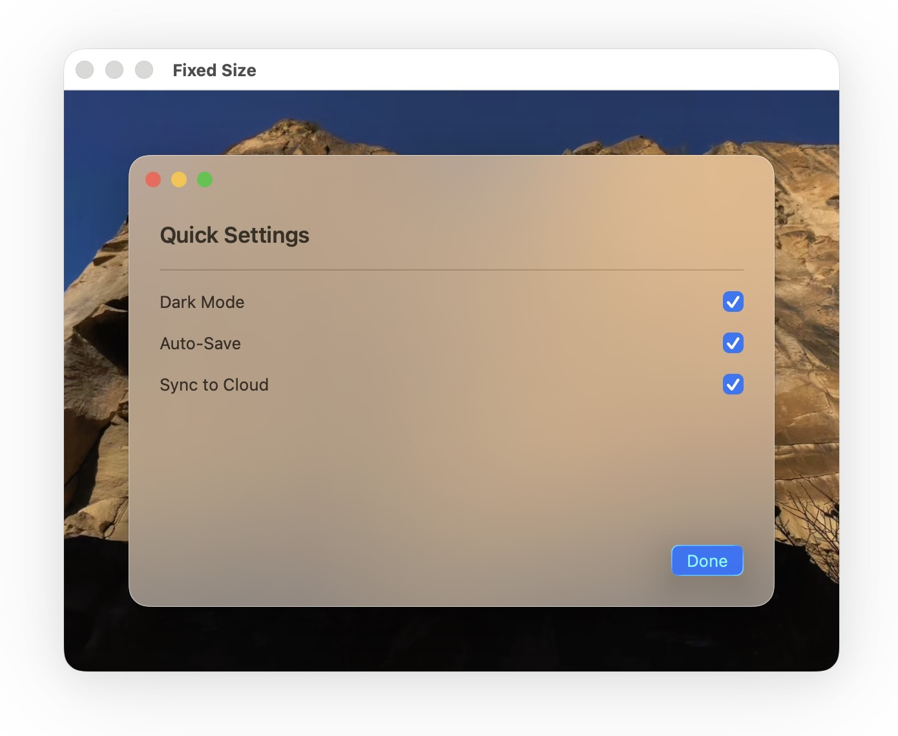

# PreviewWindow

A SwiftUI preview wrapper that simulates macOS window chrome. Useful for previewing views that rely on window-level styling (`.containerBackground`, `.presentedWindowStyle(.hiddenTitleBar)`, etc.) which don't render in standard Xcode previews.

Renders traffic lights, window border highlights, shadow, and a desktop wallpaper backdrop.



**Requires macOS 26+, Swift 6.2+**

This package follows [Semantic Versioning](https://semver.org/). While the major version is `0`, the API is not yet considered stable and may change between minor releases.

## Installation

Add to your `Package.swift`:

```swift
dependencies: [
    .package(url: "https://github.com/ordo-one/package-preview-window", from: "0.0.4"),
]
```

Then add `"PreviewWindow"` to your target's dependencies.

## Usage

```swift
import PreviewWindow

#Preview {
    PreviewWindow {
        MyView()
    }
}
```

Configuration is applied through chainable modifiers — use only what you need:

### Window Size

```swift
// Fit to content (default)
PreviewWindow { ... }

// Fixed dimensions
PreviewWindow { ... }
    .previewWindowSize(.fixed(width: 500, height: 350))
```

### Window Style

```swift
// TitleBar style — 16pt corner radius (default)
PreviewWindow { ... }

// Toolbar style — 26pt corner radius (Safari-like)
PreviewWindow { ... }
    .previewWindowStyle(.toolBar)

// Custom corner radius
PreviewWindow { ... }
    .previewWindowStyle(.custom(20))
```

### Background

```swift
// Material background (default: .thinMaterial)
PreviewWindow { ... }
    .previewWindowMaterial(.thickMaterial)

// Glass background
PreviewWindow { ... }
    .previewBackgroundGlass(.regular)

// No background
PreviewWindow { ... }
    .previewWindowMaterial(nil)
```

### Other Options

```swift
// Hide traffic lights
PreviewWindow { ... }
    .previewTrafficLights(false)

// Custom desktop wallpaper
PreviewWindow(wallpaper: { MyWallpaper() }) {
    MyView()
}

// Combine multiple modifiers
PreviewWindow {
    MyView()
}
.previewWindowSize(.fixed(width: 500, height: 350))
.previewWindowStyle(.toolBar)
.previewBackgroundGlass(.regular)
```
